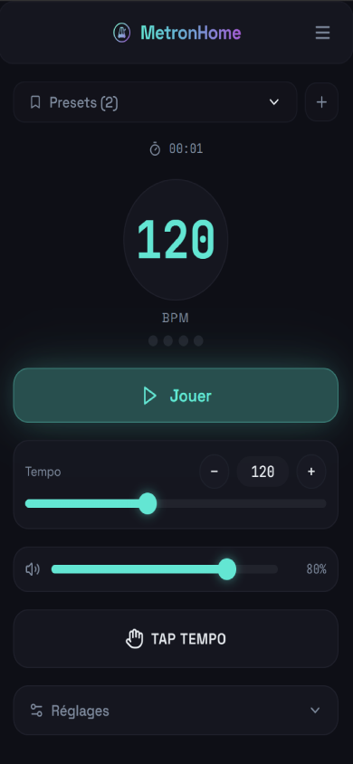

# MetronHome v2.2.0

A metronome mobile app — built with React 18, Vite and TypeScript, wrapped for Android with Capacitor 5.



## Tech stack

- **React 18 + Vite 5 + TypeScript**
- **Capacitor 5** (Android) — the web app is packaged as a native Android app
- **shadcn/ui** + **Tailwind CSS** (custom dark glassmorphism theme)
- **React Router** (routing)
- **@capacitor/preferences** for local preset persistence (SharedPreferences on Android)

## Features

- Tempo stable même écran tamisé (scheduler Web Worker)
- Écran maintenu allumé pendant la pratique (WakeLock)
- Flash visuel plein écran par beat (activable)
- Timbres de clic enrichis (woodblock, accent distinct)

## Getting started

Requires Node (npm) on the WSL/Linux side.

```bash
npm install
npm run dev      # dev server on http://localhost:8080
```

> The Vite dev server runs on port **8080** with HMR overlay disabled — runtime errors appear only in the browser console.

Other web commands (run inside `MetronHomeApp/`):

```bash
npm run build    # production web build → dist/ (Capacitor webDir)
npm run lint     # eslint (flat config)
npm run test     # vitest (jsdom)
```

## Architecture

- App entry & routes: `src/App.tsx` (`/` Index, `/presets`, `/about`, `*` NotFound)
- Metronome + preset logic in `src/hooks/` (`useMetronome`, `usePresets`, `useTapTempo`, `useSessionTimer`)
- UI components in `src/components/` (shadcn/ui base in `src/components/ui/`)
- Imports use the `@/` → `src/` alias

### Preset persistence

Presets are saved with **`@capacitor/preferences`** (native SharedPreferences on Android / UserDefaults on iOS). They survive app restarts and updates, but are lost on uninstall. On the web they fall back to `localStorage`.

## Android build (release)

The Android deliverable is an **Android App Bundle** (`.aab`), the format required by the Google Play Store.

```bash
npm run aab          # web build + Capacitor sync + Gradle bundleRelease (signed)
npm run verify:aab   # extract a signed universal APK (MetronHome-vX.Y.Z.apks)
npm run install:phone  # build + adb install on a connected phone (USB debugging on)
```

Outputs (generated on the Windows build machine):

| File | Purpose |
|------|---------|
| `MetronHome-vX.Y.Z-release.aab` | Upload to the Google Play Console |
| `MetronHome-vX.Y.Z.apks` | Signed universal APK, installable on a phone |

Build artifacts live in `C:\devapp\27.MetronHome_app\phone\`. The Gradle build runs on Windows (JDK 17 + Android SDK); on WSL only `npm run dev/build/lint/test` apply.

### Version bump

Keep these four in sync when releasing:

1. `VERSION` in `metronhome-build.bat` and `metronhome-verify.bat` (output filenames `MetronHome-vX.Y.Z-*`)
2. `versionName` in `android/app/build.gradle`
3. `version` in `package.json`

### Signing

The release is signed with `metronhome-release.keystore` (test keystore). A production Play Store release needs a dedicated **upload key** created in the Play Console.

## Slash commands (OpenCode, project-scoped)

- `/metrobuild` — automated review + Android build (`aab` + `verify:aab`)
- `/gitrelease` — creates a GitHub release and attaches the `.aab`/`.apks` assets
